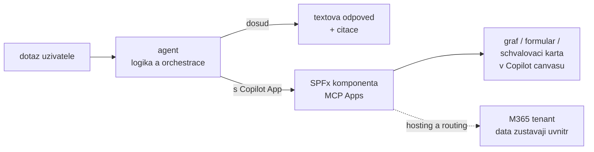

# SharePoint Copilot Apps — interaktivní UX v Copilot canvasu (Public Preview)

> Typ: povinný · Den: 4 · Odhad: **40 min** (15 výklad + 25 lab) · Publikum: **vývojáři / architekti**
> Prostředí: viz [`../../environment.md`](../environment.md) · Názvosloví: [`../../GLOSSARY.md`](../GLOSSARY.md)

Agent celý včerejšek tvaroval **text**. SharePoint Copilot Apps (SPFx 1.24, Public Preview) jsou
odpověď na otázku „a co když má odpověď být graf, formulář nebo schválení?" — SPFx
komponenty renderované **přímo v Copilot canvasu**, postavené na **MCP Apps** modelu,
hostované automaticky v tenantu. Pro SPFx vývojáře je to nejkratší cesta do světa agentů.

## Cíle

- Vědět, co SharePoint Copilot Apps jsou: SPFx komponenta v Copilot canvasu, **MCP Apps**
  model, hosting automaticky v tenantu (žádný vlastní hosting ani routing).
- Znát developer loop: scaffold (šablony Minimal / No framework / React) → lokální běh
  v **Copilot Workbench** → deploy do tenantu.
- Umět zařadit Copilot Apps na osu kurzu: UX vrstva **nad** agenty, ne další druh agenta.
- Vidět most k SPFx dovednostem — stejné packaging, tooling a struktura projektu jako
  u web partů.

## Výklad

### Co to je a proč teď

- **Copilot App = SPFx komponenta renderovaná přímo v Copilot canvasu.** Odpověď agenta
  přestává být odstavec textu a stává se z ní graf, formulář nebo schvalovací karta,
  se kterou uživatel pracuje bez opuštění konverzace.
- **Model je MCP Apps** — rozšíření MCP o interaktivní UX komponenty. Agent neposílá HTML;
  vrátí odkaz na komponentu a data, canvas ji vyrenderuje.
- **Hosting a routing řeší platforma.** Žádný App Service, žádná registrace bota, žádné
  CORS. Komponenta se nasazuje jako každý SPFx balíček do App Catalogu a **žije v M365
  tenantu** — data z ní tenant neopouštějí.
- **Proč zrovna teď**: celý dosavadní kurz tvaroval text — prompt, grounding, citace,
  redakce. Tohle je první místo, kde má výstup agenta **tvar**, a zároveň první místo,
  kde SPFx dovednosti publika platí beze zbytku.

> [!NOTE] Instruktorské demo
> Hotová Copilot App (graf nad daty nebo formulář) živě v Copilot canvasu — jeden pohled,
> žádný kód. Pointa demonstrace: tohle vrátil agent místo textu, a přitom komponenta běží
> v tenantu.



### Developer loop — SPFx, jak ho znáte

- **Scaffold** preview generatorem — instaluje se v onboardingu dne 1, ne až tady:

  ```powershell
  npm ls -g @microsoft/generator-sharepoint   # overit, ze je nainstalovana @next verze
  yo @microsoft/sharepoint
  ```

- **Tři šablony**, výběr je pedagogické rozhodnutí:
  - **Minimal** — holý model bez šumu; nejlépe je na ní vidět, jak se komponenta aktivuje.
  - **No framework** — přímo DOM API, žádná runtime závislost.
  - **React** — pro toho, kdo chce rovnou vizuál a React ze SPFx už zná.
- **Copilot Workbench** = lokální testovací prostředí, obdoba SharePoint Workbenche.
  Dev server se spouští stejným `gulp serve` loopem jako u web partů; inner loop je
  změna → uložení → reload. Konkrétní URL Workbenche ověřit proti release notes (preview).
- **Packaging beze změny**: `gulp bundle --ship` → `gulp package-solution --ship` → `.sppkg`
  do App Catalogu.

| Vrstva | Web part | Copilot App |
|---|---|---|
| Scaffold | SPFx generator | **tentýž** generator, jiná šablona |
| Jazyk a tooling | TypeScript, gulp, npm | **totéž** |
| Projektová struktura | `config/`, `src/`, `gulpfile.js` | **totéž** |
| Lokální test | SharePoint Workbench | **Copilot Workbench** |
| Packaging a nasazení | `.sppkg` → App Catalog | **totéž** |
| Kde se renderuje | stránka webu | **Copilot canvas** |
| Kdo komponentu vyvolá | autor stránky | **agent / orchestrátor** |

- Poslední dva řádky tabulky jsou celý rozdíl. Zbytek je SPFx, jak ho publikum zná —
  a proto je tenhle blok nejkratší cesta SPFx vývojáře do světa agentů.

### Kde to sedí na ose kurzu

- **Copilot Apps nejsou další druh agenta.** Na rozhodovací ose z
  [`../../agent-landscape/`](../agent-landscape/) pro ně není příčka —
  nesoutěží s deklarativním agentem ani s custom enginem. Jsou vrstva **nad** konverzací:
  agent zůstává tam, kde byl, jen dostane obrazovku.
- **MCP nit kurzu tady vrcholí**: federated konektory přes MCP
  ([`../../knowledge-grounding/`](../knowledge-grounding/)) → MCP nástroj
  vs. vlastní action handler ([`../../actions-graph/`](../actions-graph/))
  → **MCP Apps** = tentýž protokol rozšířený o UX komponenty.
- **Middleware z [`../../middleware-policy/`](../middleware-policy/) platí
  i pro UX výstup.** Co agent nesmí říct textem, nesmí ani vykreslit do karty. Filtry se
  aplikují na **data, která do komponenty vstupují** — ne na to, co z ní vypadne.
- **App nepřidává vlastní autorizaci.** Data v kartě vidí ten, komu je agent poslal;
  hranicí zůstává scope agenta a oprávnění uživatele. Komponenta je poslední místo,
  kde je vhodné řešit, kdo co smí vidět.

## Klíčové rozlišení

- **Copilot App** (UX komponenta v canvasu) vs. **agent** (logika a orchestrace) —
  App nenahrazuje agenta, dává mu ruce a obrazovku.
- **MCP Apps model s tenant hostingem** — na rozdíl od obecných MCP Apps neřešíš hosting
  ani routing; komponenta žije v M365 tenantu (data sovereignty zdarma).
- **SPFx dovednosti se přenášejí 1:1** — packaging, tooling, projektová struktura;
  jazyk je tu TypeScript — stejně jako ve zbytku kurzu, most k SPFx je bezešvý.
- **Public Preview** — bez Copilot licence pro build (v preview), store distribuce zatím
  nepodporovaná, pracovní název se může změnit.

## Naše prostředí

**Hands-on** (rozhodnutí autora 2026-08-06 — klíčová vazba na SPFx kurzy): studenti si
scaffoldnou a rozběhnou vlastní Copilot App lokálně v **Copilot Workbench** — v preview
to nevyžaduje Copilot licenci. Deploy do `spdemo.online` dělá instruktor jako demo (dle
stavu rolloutu). Preview generator (`@next`) se instaluje **už v onboardingu dne 1**,
ne až tady — viz go/no-go v [`instructor-notes.md`](instructor-notes.md).

## Lab

Viz [`lab-first-copilot-app.md`](lab-first-copilot-app.md) — komponenta vykreslí **tikety,
které ráno založil vlastní agent studenta** (list `Tikety`), včetně sloupců `Zadavatel`
(zapsal kód) a `Created By` (ví platforma). Samostudium navíc:
[GitHub — spfx-copilot-apps samples](https://github.com/pnp/spfx-copilot-apps).

## Nosná linka

Support Asistent dnes dopoledne dostal akce a odpoledne middleware — a tady je vidět,
**kam jeho výstup může dorůst**: tikety, které založil, se z řádků v listu stanou kartou
v Copilot canvasu. Interaktivní eskalace z dotazu 3 ([`../../scenario-support-agent.md`](../scenario-support-agent.md))
jako interaktivní schvalovací karta místo textu. Student si první Copilot App postaví
sám; napojení na vlastního agenta zůstává jako roadmapa do capstonu.

## Zdroje (Microsoft)

- [SharePoint Framework v1.24 preview release notes](https://learn.microsoft.com/en-us/sharepoint/dev/spfx/release-1.24.0)
- [Going beyond text in Microsoft 365 Copilot: Introducing SharePoint Copilot Apps](https://devblogs.microsoft.com/microsoft365dev/going-beyond-text-in-microsoft-365-copilot-introducing-sharepoint-copilot-apps/)

## Stav produktu / delta

> [!WARNING] Ověřit k datu běhu — stav k 2026-08.
> **Public Preview** (SPFx 1.24 beta.1, 2026-07-08): rollout dokončen ~2026-07-20,
> renderuje se zatím **jen v Copilot canvasu**, store distribuce nepodporovaná, licencování
> po GA se může změnit, i pracovní název „SharePoint Copilot Apps" se může změnit.
> Před během ověřit release notes a stav GA — tenhle blok je nejrychleji se měnící
> v celém kurzu.
